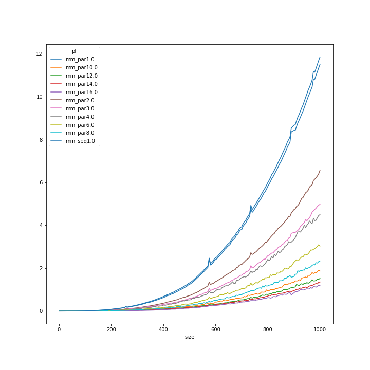
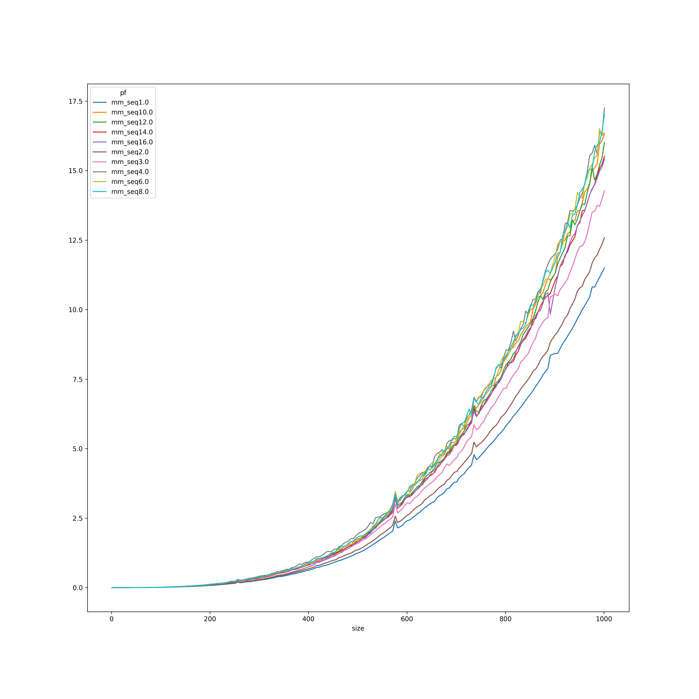
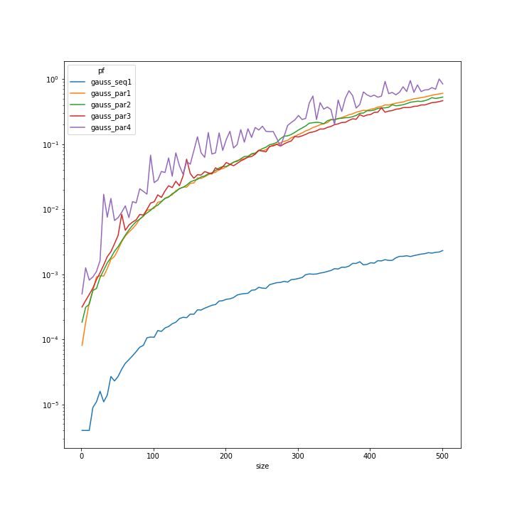

# Setup and compilation
1. Adjust `PATHS` Makefile variable if needed to provide ifrot and mpi executables.
2. Adjust `F2P` Makefile variable to provider fpy executable
3. Build project with `make main` (using ifort compiler by default)

# Running time measurements
Run `./out/main.o` or use `make run` to run time measurements of both sequential and parallel functions. Program arguments:
* minimal tested matrix size
* maximum tested matrix size
* step by which matrix size is increased between tests

When invoking via `make run` place the arguments in `ARGS` variable. Additional variable `IMGS` can be used to control number of parallel processes. Defaults to 4.

## Example
```bash
# time operations on matrices of sizes from 10 to 501 in 5 step increment
# runninng 2 processes
make run ARGS="10 501 5" IMGS=2
```

# Python bindings

## Building
Issue `make py/sequential.so` to generate the python bindings.

## Running sample app

To successfully run the sample application environment variable `LD_LIBRARY_PATH` must be set to folder containing the `libifort.so`, for example `LD_LIBRARY_PATH=/opt/intel/compilers_and_libraries_2018.2.199/linux/compiler/lib/intel64/`.  
Run `./py/example.py` for a sample application which invokes matrix multiplication and gaussian elimination and validates their results.


# Documentation

## Generation
Documentation can be generated with `make doc` or by issuing the `doxygen` command directly.

## Viewing
The documentation is stored in the `doc/html` folder. Open [./doc/html/index.html](./doc/html/index.html) in the browser to view it.

# Timings

## Matrix Multiplication


Graph presents execution time in seconds in a function of matrix side size. Colors identify processes count and function name.

Interesting thing to notice is that even increasing image number way above cpu cores (16 images on 4 core machine) yielded performance improvements.

Another observation is that executing multiple images when only one is doing work and others wait on `sync all` still causes all of them to use 100% of CPU. As the graph below shows, launching additional images hindered perfromanceo of sequential multiplication performed on only one of them:



## Gaussian elimination


Suprisingly, the parallel implementation decreased perfromance instead of improving it.